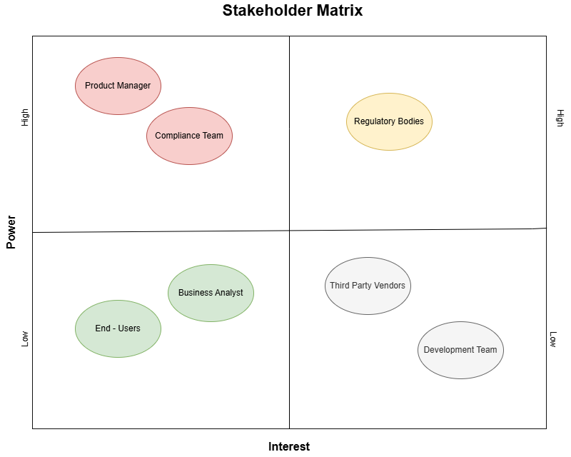
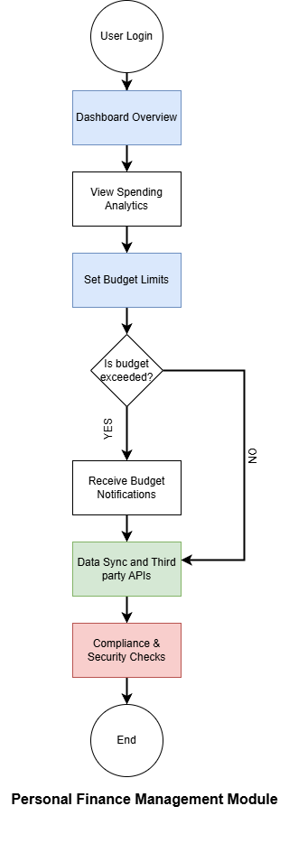
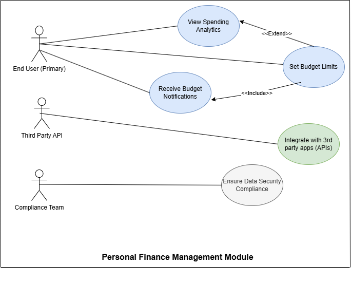
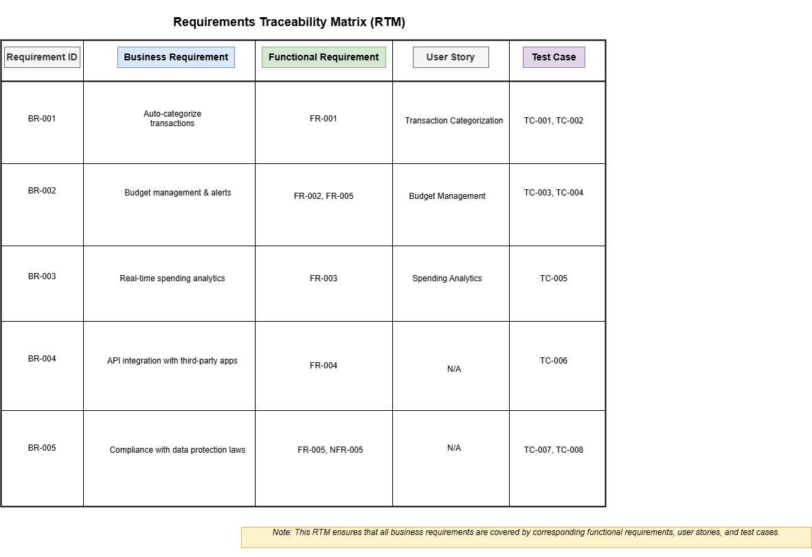

## *Personal Finance Management Module for Digital Banking Platform*

---

## **1. Project Introduction**
This project focuses on enhancing personal finance management within a digital banking platform. The goal is to improve customer engagement, financial literacy, and satisfaction by providing advanced budgeting, spending analytics, and seamless integration with third-party financial services.

---

## **2. Stakeholder Analysis**

### **Stakeholder Matrix:**

### **Key Stakeholders:**

| **Stakeholder**           | **Role**                                | **Responsibility**                                      | **Influence Level** |
|---------------------------|-----------------------------------------|--------------------------------------------------------|---------------------|
| Product Manager           | Defines product vision                  | Sets feature priorities, roadmap planning               | High                |
| Business Analyst          | Requirement gathering & documentation   | Bridges business and technical teams                    | Medium              |
| Development Team          | Implements technical solutions          | Codes, develops, and integrates new features            | Low                 |
| QA/Testers                | Ensures quality assurance               | Validates that the system meets business requirements   | Medium              |
| Compliance & Risk Team    | Ensures regulatory compliance           | Reviews security and legal compliance                   | High                |
| End Users (Customers)     | Uses the platform                       | Provides feedback, interacts with features              | High                |
| Third-Party Vendors       | API providers                           | Offers external services like payment gateways          | Low                 |
| Regulatory Bodies         | Ensures legal compliance                | Enforces data protection and financial regulations      | High                |

---

## **3. Business Requirements (BRDs)**

1. **BR-001:** The system should allow users to categorize their transactions automatically.
2. **BR-002:** Users should be able to set monthly budgets and receive alerts when limits are reached.
3. **BR-003:** Provide real-time spending analytics with interactive dashboards.
4. **BR-004:** Enable secure integration with third-party financial apps using open banking APIs.
5. **BR-005:** Ensure compliance with GDPR and financial data protection regulations.

---

## **4. Functional Requirements (FRs)**

1. **FR-001:** The platform shall automatically categorize transactions based on merchant type and user preferences.
2. **FR-002:** Users shall have the ability to create, edit, and delete budget categories.
3. **FR-003:** The system shall generate real-time spending reports with graphical analytics.
4. **FR-004:** The platform shall support API connections to third-party financial services securely.
5. **FR-005:** Users shall receive push notifications when budget thresholds are exceeded.

---

## **5. Non-Functional Requirements (NFRs)**

1. **NFR-001:** The system shall ensure 99.9% uptime for critical financial services.
2. **NFR-002:** All financial data shall be encrypted both in transit and at rest.
3. **NFR-003:** The platform shall support up to 1 million concurrent users without performance degradation.
4. **NFR-004:** The user interface shall load within 2 seconds under standard network conditions.
5. **NFR-005:** The system shall comply with GDPR, PSD2, and other relevant financial regulations.

---

## **6. User Stories with Acceptance Criteria**

### **User Story 1:** *Transaction Categorization*
- **As a** user,
- **I want** my transactions to be automatically categorized,
- **So that** I can easily track my spending habits.

**Acceptance Criteria:**
- Transactions are categorized based on merchant data.
- Users can manually re-categorize transactions.
- Categories are updated in real-time.

---

### **User Story 2:** *Budget Management*
- **As a** user,
- **I want** to set monthly budgets for different categories,
- **So that** I can control my spending effectively.

**Acceptance Criteria:**
- Users can create/edit/delete budget categories.
- Notifications are triggered when budget limits are reached.
- Budget status is visually represented in the dashboard.

---

### **User Story 3:** *Spending Analytics*
- **As a** user,
- **I want** to see real-time spending analytics,
- **So that** I can understand my financial behavior.

**Acceptance Criteria:**
- Dashboards display categorized spending trends.
- Filters allow customization of data views.
- Reports can be exported in PDF/CSV formats.

---

## **7. Process Flow Diagram**

This diagram illustrates the user's journey from login to budget management, including decision points such as budget limit checks.

---

## **8. Use Case Diagram**

The use case diagram showcases interactions between the system and its users, including budget management, analytics, and compliance features.

---

## **9. Requirements Traceability Matrix (RTM)**

This RTM ensures that all business requirements are covered by corresponding functional requirements, user stories, and test cases.

---

## **10. Conclusion**

This project demonstrates the complete lifecycle of requirements gathering, from stakeholder analysis to user stories, functional specifications, process flows, and traceability. It showcases key business analysis skills, including elicitation, documentation, stakeholder management, and system design tailored for the finance domain.
